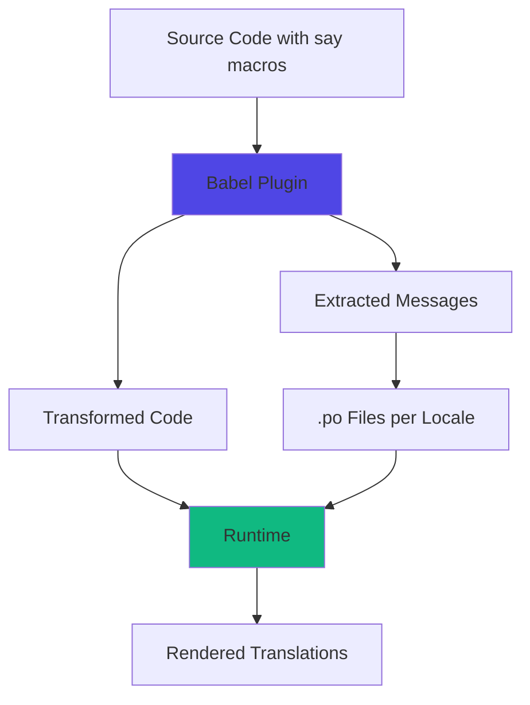

Saykit uses a **macro-based approach** to internationalization, transforming your source code at compile-time rather than relying solely on runtime processing. This approach provides type safety, better performance, and automatic message extraction.

## Compile-Time vs Runtime Flow



### Compile-Time Processing

During build, the Babel plugin:

1. **Parses** your source code looking for `say` macro calls
2. **Extracts** messages and converts them to ICU MessageFormat
3. **Transforms** macro calls into runtime function calls
4. **Generates** unique IDs for each message (via hashing)

### Runtime Processing

At runtime, the Say class:

1. **Loads** translations for the active locale
2. **Formats** messages using ICU MessageFormat
3. **Manages** locale state and fallbacks

## The Babel Plugin

The Babel plugin is the heart of Saykit's compile-time transformation. It processes two types of syntax:

### Tagged Template Literals

<CodeGroup>
```tsx Input
say`Hello, ${name}!`
```

```tsx Output
say.call({ id: "a1b2c3", 0: name })
```
</CodeGroup>

The plugin:
- Extracts the message `"Hello, {0}!"`
- Generates a hash ID (`a1b2c3`)
- Transforms the tagged template into a `call()` method
- Maps placeholders to numbered parameters

**Location:** `packages/plugin-babel/src/core/visitor.ts:14-26`

### Method Calls (plural, select, ordinal)

<CodeGroup>
```tsx Input
say.plural(count, {
  one: 'You have 1 item',
  other: 'You have # items'
})
```

```tsx Output
say.call({ 
  id: "d4e5f6", 
  0: count 
})
```
</CodeGroup>

The plugin converts CLDR plural rules into ICU MessageFormat:

```
{0, plural,
  one {You have 1 item}
  other {You have # items}
}
```

**Location:** `packages/plugin-babel/src/features/js/parser.ts:44-100`

## Message Processing Pipeline

### 1. Parsing Phase

The visitor walks the AST looking for expressions and JSX elements:

```typescript
class Visitor {
  Expression(path) {
    const message = parseExpression(this.context, path.node);
    if (message) {
      this.context.foundMessages.push(message);
      const replacement = generateSayCallExpression(message);
      path.replaceWith(replacement);
    }
  }
}
```

**Location:** `packages/plugin-babel/src/core/visitor.ts:14-26`

### 2. Message Conversion

Messages are converted to ICU MessageFormat:

<CodeGroup>
```tsx Simple Message
"Hello, {name}!"
```

```tsx Plural Message
"{count, plural,\n  one {1 item}\n  other {# items}\n}"
```

```tsx JSX Elements
"Hello from the <0>{region}</0>"
```
</CodeGroup>

**Location:** `packages/plugin-babel/src/core/messages/convert.ts:10-50`

### 3. Hash Generation

Each message gets a unique ID based on its content and optional context:

```typescript
function generateHash(message: string, context?: string) {
  // Generates a stable hash like "a1b2c3d4"
}
```

This allows:
- Stable IDs across builds
- Context-based disambiguation
- Optional custom IDs via `say({ id: 'custom' })`

**Location:** `packages/plugin-babel/src/core/messages/hash.ts`

### 4. Extraction

Messages are collected and written to translation files:

```typescript
interface Message {
  message: string;        // ICU MessageFormat string
  translation?: string;   // Translated version
  id?: string;           // Custom or generated ID
  context?: string;      // Disambiguation context
  comments: string[];    // Translator comments
  references: string[];  // File:line references
}
```

**Location:** `packages/config/src/shapes.ts:8-16`

## Package Structure

Saykit is organized as a monorepo with specialized packages:

<CardGroup cols={2}>
  <Card title="saykit" icon="code">
    Core runtime - the `Say` class and type definitions
    
    **Package:** `packages/integration`
  </Card>
  
  <Card title="@saykit/babel-plugin" icon="wand-magic-sparkles">
    Babel plugin for macro transformation
    
    **Package:** `packages/plugin-babel`
  </Card>
  
  <Card title="@saykit/config" icon="gear">
    Configuration management and CLI tools
    
    **Package:** `packages/config`
  </Card>
  
  <Card title="@saykit/format-po" icon="file-lines">
    PO/POT file formatter (default)
    
    **Package:** `packages/format-po`
  </Card>
  
  <Card title="@saykit/react" icon="react">
    React integration with `<Say>` component
    
    **Package:** `packages/integration-react`
  </Card>
  
  <Card title="@saykit/unplugin" icon="plug">
    Universal plugin for Vite, Webpack, etc.
    
    **Package:** `packages/unplugin`
  </Card>
</CardGroup>

## Key Design Principles

### Type Safety

The `Say` class is fully typed with TypeScript generics:

```typescript
class Say<
  Locale extends string = string,
  Loader extends Say.Loader<Locale> | undefined = Say.Loader<Locale> | undefined
> {
  // Locale type is enforced throughout
}
```

### Zero Runtime Overhead

Macros are compiled away - no runtime macro processing:

- ✅ Message extraction happens at build time
- ✅ IDs are pre-generated
- ✅ Only the formatted message runs at runtime

### Framework Agnostic

The core is framework-independent:

- Works with React, Vue, Svelte, etc.
- Integrations provide framework-specific helpers
- CLI tools work standalone

### Developer Experience

Natural syntax with full IDE support:

- Tagged templates for simple messages
- Method calls for plurals/selects
- TypeScript autocompletion
- JSX component syntax for React

<Note>
  The Babel plugin must be configured in your build tool for macros to work. See [Installation](/installation) for setup instructions.
</Note>
